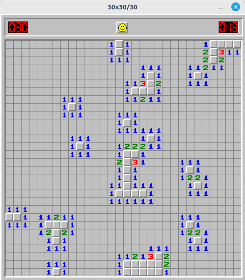

# Minesweeper

A clone of the good old Minesweeper game, trying to keep the original style as much as possible. Powered by 
[raylib-go](https://github.com/gen2brain/raylib-go).



## How to Play

Just launch the binary and play!

```shell
$ ./minesweeper
```
You can also specify the size of the board and the number of mines.

```shell
$ ./minesweeper -w 30 -h 20 -m 100
````


## How to Build

```shell
$ go build -o minesweeper
```

On Linux, you might want to install the following packages (e.g, Ubuntu):

    - libgl-dev
    - libxi-dev

